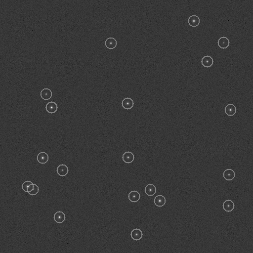

# SourceExtraction.jl

[](https://hzarei4.github.io/SourceExtraction.jl/stable/)
[](https://hzarei4.github.io/SourceExtraction.jl/dev/)
[](https://github.com/hzarei4/SourceExtraction.jl/actions/workflows/CI.yml?query=branch%3Amain)


`SourceExtraction.jl` provides fast, allocation-free, threshold-aware source detection and ROI extraction for microscopy and astronomical images, with CUDA support.


## Quick start

```julia
using SourceExtraction

xs, ys = find_sources(image)
```

For fainter sources, lower the detection threshold:

```julia
xs, ys = find_sources(
    image;
    threshold_fraction = 0.05,
)
```

or set the threshold explicitly:

```julia
xs, ys = find_sources(
    image;
    threshold = 0.1f0,
)
```

## Microscopy example

Detected sources are marked with rings in this simulated bead image:



See [`examples/microscopy_source_detection.jl`](examples/microscopy_source_detection.jl)
for the simulation and detection code, or download the
[original TIFF image](examples/sample_beads_image_detected_sources.tiff).

## Prepared API

For repeated processing, prepare the extractor once and reuse its buffers:

```julia
extractor = SourceExtractor(
    image;
    dog = DoG(1f0, 3f0),
    detector = LocalMaximaDetector(0.1f0; radius=1),
    roi_size = (11, 11),
    max_sources = 100_000,
)

result = extract_sources!(extractor, image)

indices = source_indices(result)
scores  = source_scores(result)
rois    = source_rois(result)
```

The same API works with `CuArray`s when CUDA.jl is loaded.

Stacks with layout `(x, y, frame)` are processed as independent 2-D frames.

## Performance

Representative benchmarks on a 2048×2048 `Float32` image.

### Strict local-maxima detection

`SourceExtraction.jl` and `ImageFiltering.findlocalmaxima` were verified to return the same source positions before timing.

| Workload | SourceExtraction.jl | ImageFiltering | Speedup | SourceExtraction allocations |
|---|---:|---:|---:|---:|
| Raw strict 3×3 local maxima | **28.03 ms** | 42.33 ms | **1.51×** | **0 B** |
| Threshold = 0.999 | **1.86 ms** | 43.77 ms | **23.53×** | **0 B** |
| Threshold = 0.990 | **2.42 ms** | 43.54 ms | **18.01×** | **0 B** |
| Threshold = 0.900 | **6.43 ms** | 44.26 ms | **6.88×** | **0 B** |
| DoG-filtered image, threshold = 0.1 | **5.54 ms** | 37.19 ms | **6.71×** | **0 B** |

The larger speedups at higher thresholds come from rejecting sub-threshold pixels before neighborhood comparisons.

### Astronomy-oriented comparison

On the same 2048×2048 DoG-filtered image and the same numerical threshold:

| Method | Time | Sources |
|---|---:|---:|
| SourceExtraction detect only | **2.11 ms** | 1474 |
| SEP minimal extraction | 19.70 ms | 1461 |

These methods do not use identical source definitions: `SourceExtraction.jl` detects strict local maxima, while SEP performs thresholded connected-component extraction and measurements. The comparison is therefore practical rather than algorithmically exact.

For broader extraction pipelines on the same synthetic image:

| Method | Time | Sources |
|---|---:|---:|
| SourceExtraction DoG + detect | **15.98 ms** | 1474 |
| SEP background + extract | 133.99 ms | 1292 |
| SEP default extract | 215.77 ms | 1561 |
| SExtractor CLI (WSL native filesystem) | 116.61 ms | 1291 |

The SEP and SExtractor rows perform additional work and should be treated as contextual pipeline comparisons rather than exact detector benchmarks.

### CUDA

For 512×512 `Float32` frames with DoG filtering, detection, and 11×11 ROI extraction:

| Frames | DoG filtering | Detection | ROI extraction | Full pipeline |
|---:|---:|---:|---:|---:|
| 1 | 56.4 μs | 18.1 μs | 34.8 μs | 96.1 μs |
| 10 | 462.9 μs | 85.5 μs | 271.2 μs | 813.3 μs |
| 100 | 4.266 ms | 764.9 μs | 2.593 ms | 7.574 ms |

The 100-frame case processes about 510,000 detected sources and extracts 11×11 ROIs in about 7.6 ms.

See [`benchmark/`](benchmark/) for the complete benchmark setup.


## License

MIT
